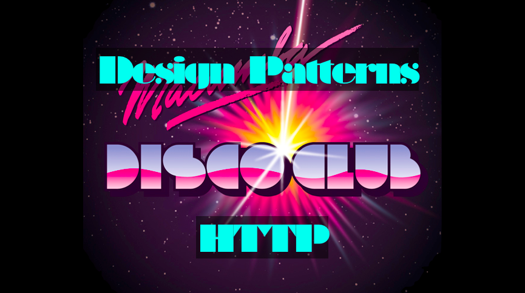

# Design Patterns Disco Club HTTP

Sample audio server to play music by playing with HTTP design patterns during our workshop.

This audio server exposes endpoints to:
- A **sampler** (sample player) that can play audio samples stored in the /app folder
- A GM **synthesizer** that can play the built-in GM sounds from the default soundbank
- A unique **director** that can provide guidance to other players: common tempo, main theme melody...

## Audio Server Commands

    sampler/{samplename} // (sample name without the ”.wav” extension)
    synth/{note}/{presetGM}/{durationMs} // note 0-127, preset 0-127, duration in milliseconds

## Metronome Events 

    beat/{timeInMs}/{stepNb} // from metronome, step number in 0..3
    
where:

    stepNb = (int)((timeInMs/1000)%4) // modulo 4 every second
    
## Latency 

IRC works by polling, usually every second, which makes musical synchronization sloppy at best. This results in a music closer to Musique Concrète than to Disco music. Still, it's fun to collaborate around a same piece of technology & music.

